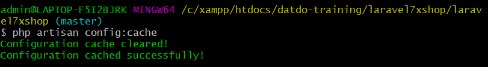
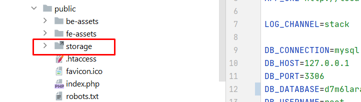
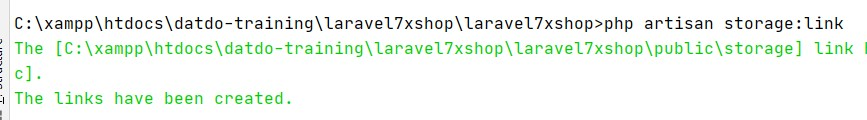
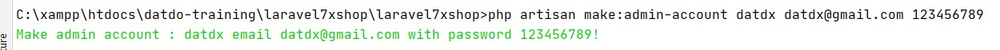

# laravel7xshop
### 1 - tạo CSDL mới và import SQL từ file laravel7xcrud.sql vào trong CSDL mới của bạn
### 2 - thay đổi các thông số kết nối đến CSDL trong file .env
update config cache = câu lệnh bên dưới như hình ảnh sau   
` php artisan config:cache `   

### 3 - xóa folder ( symlink ) có tên storage trong folder public

### 4 - chạy command bên dưới để tạo lại storage link 
` php artisan storage:link `

### 5 - chạy command để tạo ra 1 admin mới với password do bạn tự chọn
```
mở source code trong phpstorm và truy cập vào folder app/Console và tạo 1 folder mới có tên là "Commands"
sau đó mở đường dẫn https://github.com/dathalongbay/laravel7xshop/tree/master/doc và copy file 
MakeAdminAccount.php vào đường dẫn app/Console/Commands trong IDE Phpstorm 
Tiếp tục chạy lệnh sau trong terminal để tạo 1 tài khoản mới 
> php artisan make:admin-account {name} {email} {password} 
```

### 6 - run : php artisan serve --port=8001 
### 7 - URL admin : http://127.0.0.1:8001/backend/admin-login


